# Procesverslag
**Auteur:** Romeo Moolenaar 500817013

Markdown cheat cheet: [Hulp bij het schrijven van Markdown](https://github.com/adam-p/markdown-here/wiki/Markdown-Cheatsheet). Nb. de standaardstructuur en de spartaanse opmaak zijn helemaal prima. Het gaat om de inhoud van je procesverslag. Besteedt de tijd voor pracht en praal aan je website.

> Hier een link van mijn Codepen.io: [Klik hier](https://codepen.io/romeomoolenaar/pens/public)

## Bronnenlijst
1. -bron 1-
2. -bron 2-
3. -...-

## Eindgesprek (week 7/8)

-dit ging goed & dit was lastig-

**Screenshot(s):**

-screenshot(s) van je eindresultaat-

## Voortgang 3 (week 6)

-same as voortgang 1-

## Voortgang 2 (week 5)

-same as voortgang 1-

## Voortgang 1 (week 3)

### Stand van zaken

-dit ging goed & dit was lastig-

**Screenshot(s):**

-screenshot(s) van hoe ver je bent-

### Agenda voor meeting

-samen met je groepje opstellen-
>Carmen en ik gaan op:

1. De dag na de les 19 septemeber 2020 begin maken met CSS.
2. Vragen opstellen voor de studentenassistenten. 
3. Kijken of we al iets met Javascript kunnen doen?
4. Huiswerk van andere medestudenten bekijken voor eventuele aanvulling van eigen proces.

### Verslag van meeting

-na afloop snel uitkomsten vastleggen-

## Intake (week 1)

**Je startniveau:**
> Mijn start niveau is op dit moment rood. 

**Je focus:** 
> Ik ga mij focussen op een responsive website maken.

**Je opdracht:** 
[URL naar website:](https://www.oneplus.com/nl)

**Screenshot(s):**
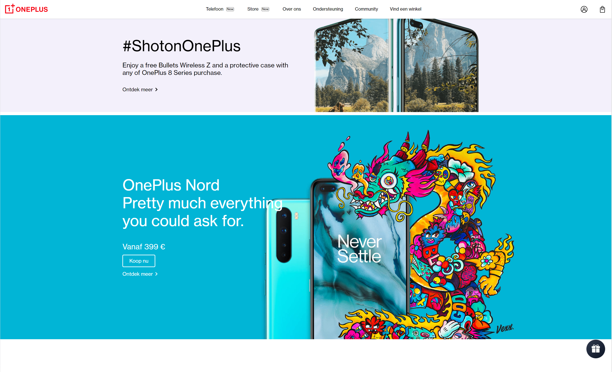

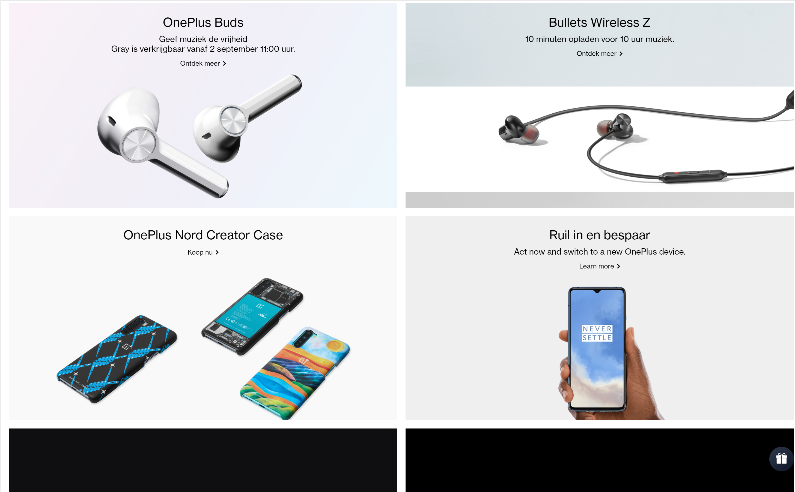
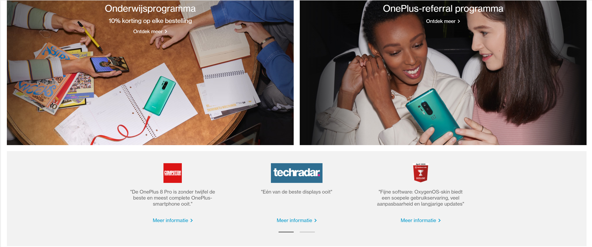
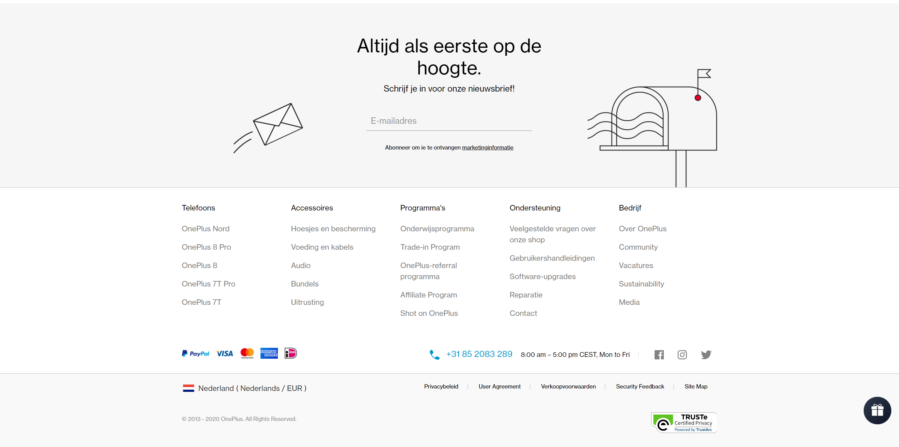
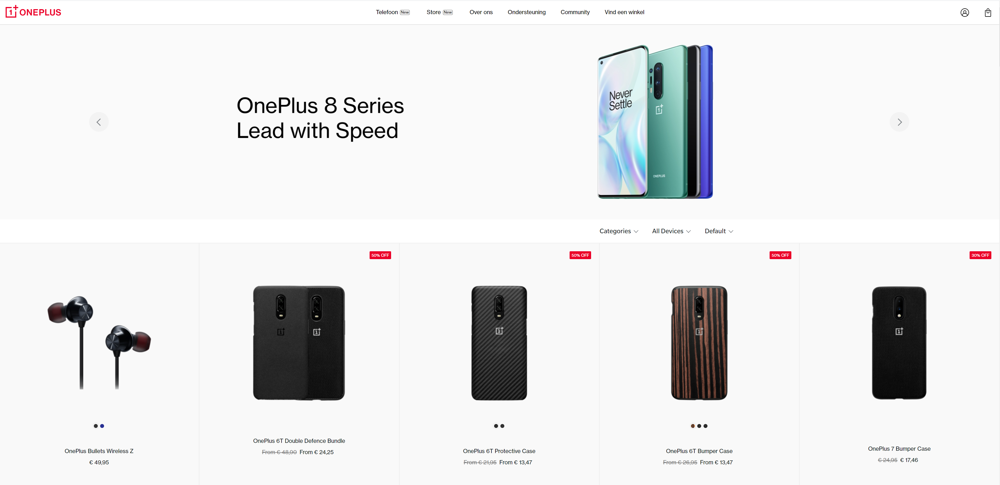
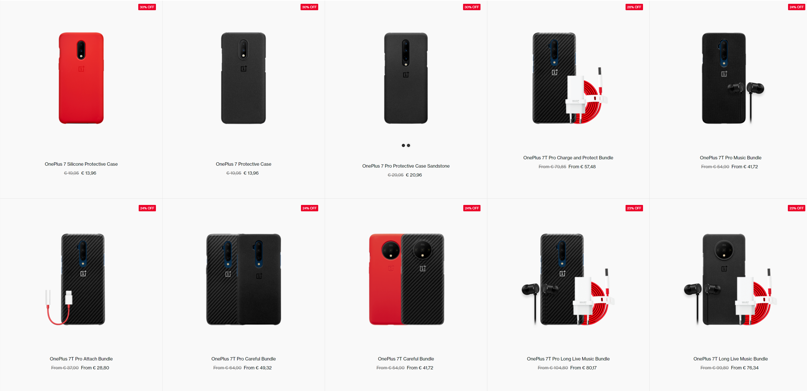
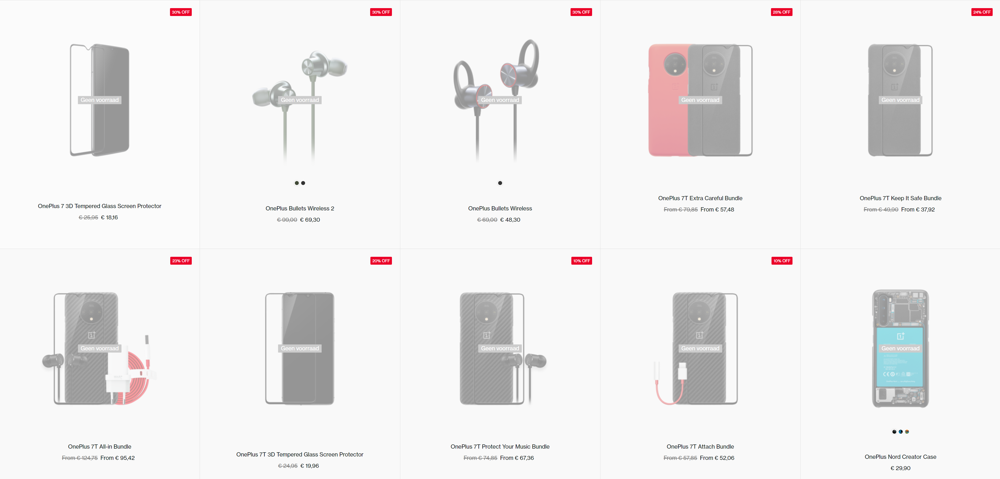
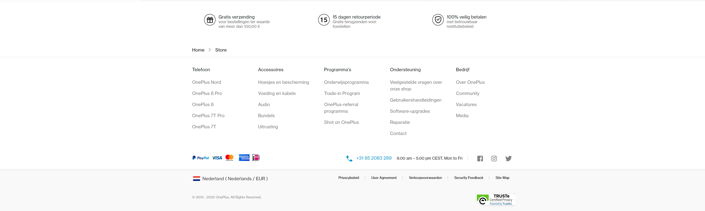

**Breakdown-schets(en):**
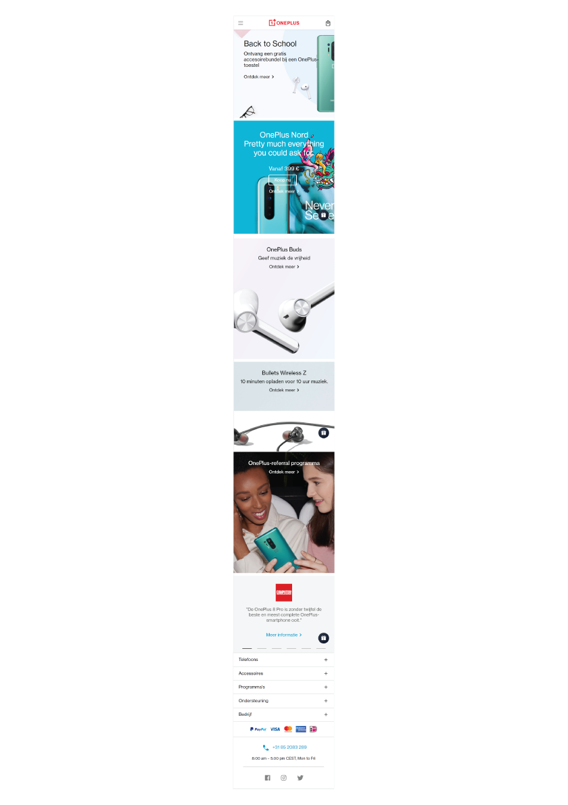
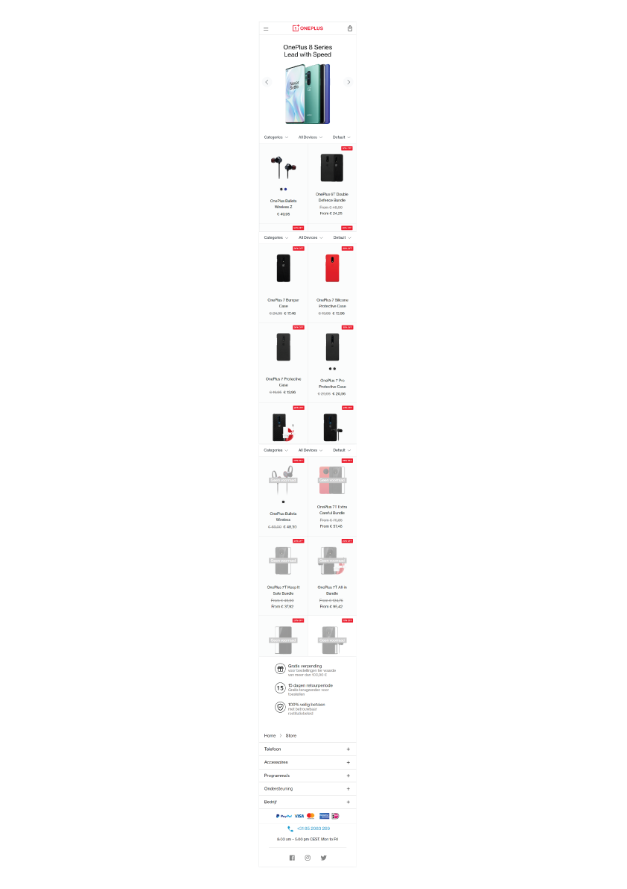
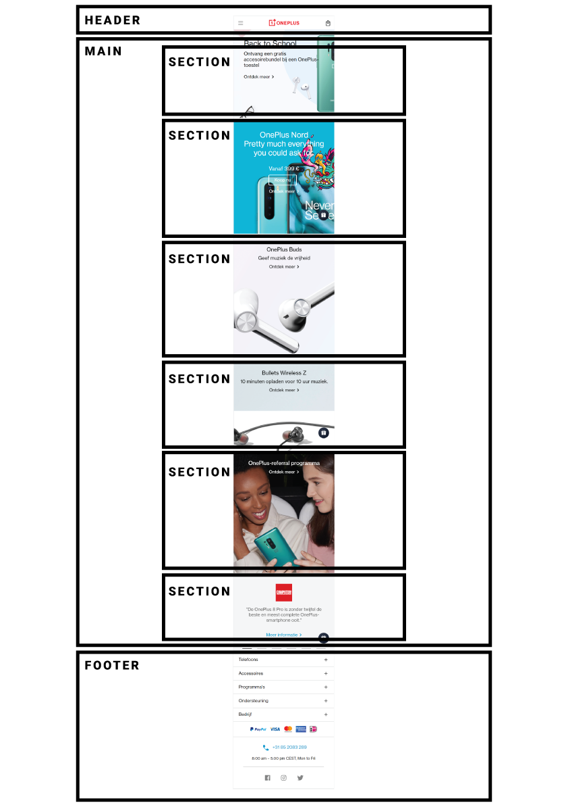
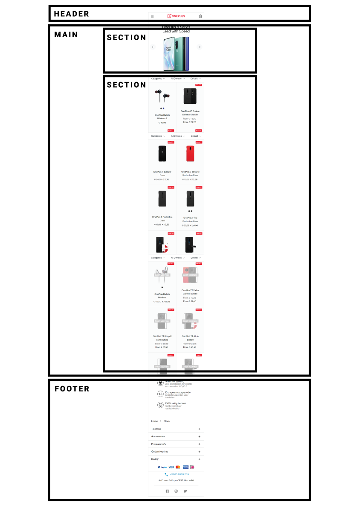
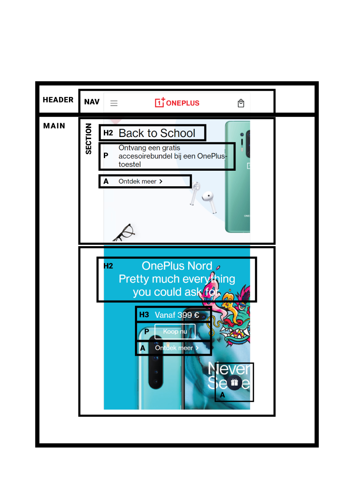
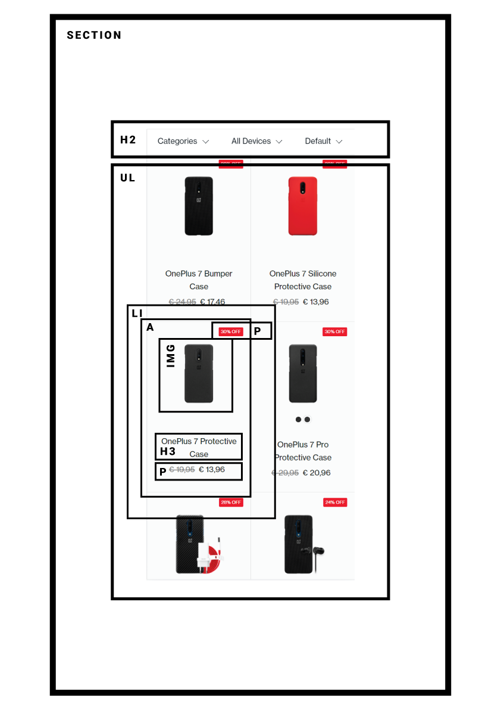
