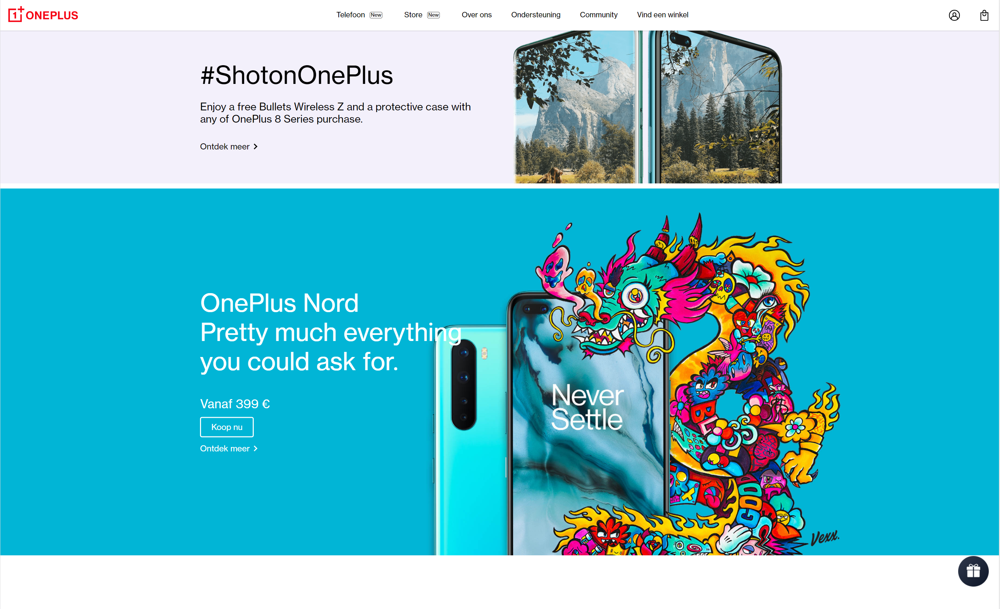

# Procesverslag
**Auteur:** Romeo Moolenaar 500817013

Markdown cheat cheet: [Hulp bij het schrijven van Markdown](https://github.com/adam-p/markdown-here/wiki/Markdown-Cheatsheet). Nb. de standaardstructuur en de spartaanse opmaak zijn helemaal prima. Het gaat om de inhoud van je procesverslag. Besteedt de tijd voor pracht en praal aan je website.

## Bronnenlijst
1. -bron 1-
2. -bron 2-
3. -...-

## Eindgesprek (week 7/8)

-dit ging goed & dit was lastig-

**Screenshot(s):**

-screenshot(s) van je eindresultaat-

## Voortgang 3 (week 6)

-same as voortgang 1-

## Voortgang 2 (week 5)

-same as voortgang 1-

## Voortgang 1 (week 3)

### Stand van zaken

-dit ging goed & dit was lastig-

**Screenshot(s):**

-screenshot(s) van hoe ver je bent-

### Agenda voor meeting

-samen met je groepje opstellen-

### Verslag van meeting

-na afloop snel uitkomsten vastleggen-

## Intake (week 1)

**Je startniveau:** -kies uit zwart, rood óf blauw-
Mijn start niveau is op dit moment rood. 

**Je focus:** 
Ik ga mij focussen op een responsive website maken.

**Je opdracht:** -link naar de website die je gaat namaken óf de naam van je eigen ontwerp-
URL: https://www.oneplus.com/nl

**Screenshot(s):**

2. (images/Proces/Homepage_website2.PNG)
3. (images/Proces/Homepage_website3.PNG)
4. (images/Proces/Homepage_website4.PNG)
5. (images/Proces/Homepage_website5.PNG)

**Breakdown-schets(en):**

